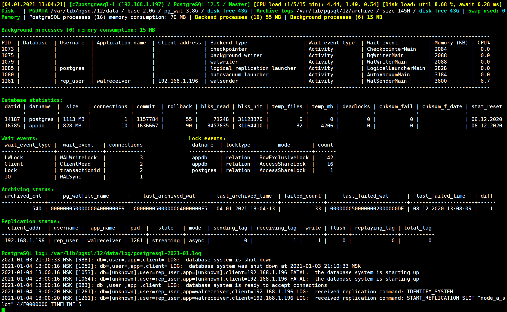
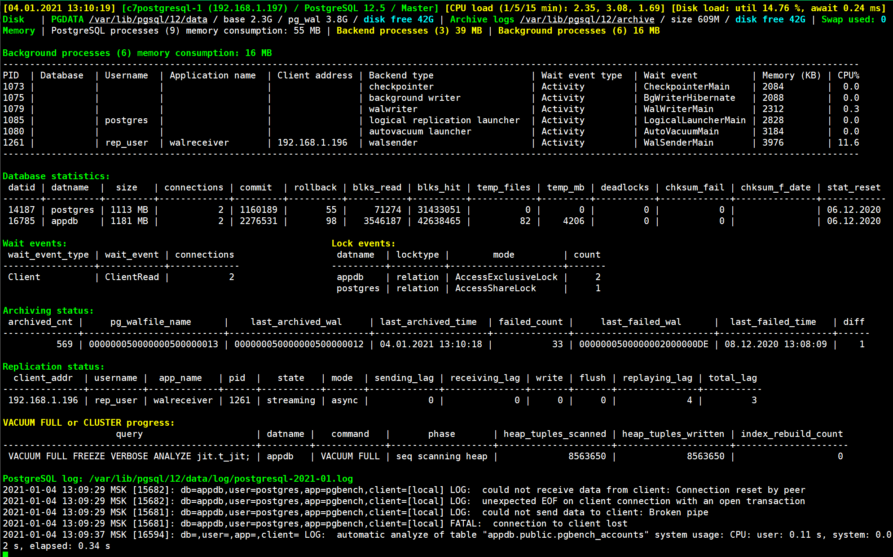

## pg_dba_scripts - PostgreSQL DBA scripts

A collection of shell scripts for PostgreSQL database administrator (DBA). Tested on PostgreSQL 12-13 under CentOS 7.

- [scripts/pg_database_activity.sh](#pg_database_activity). PostgreSQL monitoring script, all information is displayed on one page. Displays PostgreSQL version and status (Master / Replica), hostname and IP address, CPU and Disks load. Shows the sizes of the main PostgreSQL directories, archived logs and free disk space, Swap usage. It also displays memory consumption by PostgreSQL processes, statistics on databases, waits and locks, archive and replication statuses. When activities occur in PostgreSQL, the progress of operations is displayed: vacuum, vacuum full or cluster, index creation, analyze, pg_basebackup. At the end, the last entries of the PostgreSQL log file are displayed. For ease of perception, information is displayed in color.
- [scripts/pg_database_activity_refresh.sh](#pg_database_activity). Fast refresh of the **pg_database_activity.sh** script every 5 seconds.
- [scripts/pg_database_hugepages.sh](#pg_database_hugepages). Shows current usage of HugePages and recommended settings for PostgreSQL.
- [scripts/pg_database_start.sh](#pg_database_start). Start PostgreSQL, confirmation is required.
- [scripts/pg_database_stop.sh](#pg_database_stop). Stop PostgreSQL, confirmation is required.
- [scripts/pg_database_status.sh](#pg_database_status). PostgreSQL status. Additionally, PostgreSQL processes and replication services are displayed.
- [scripts/pg_database_reload_conf.sh](#pg_database_reload_conf). Reloads PostgreSQL configuration files (postgresql.conf, postgresql.auto.conf, pg_hba.conf, pg_ident.conf), displays records related to changes from the log file. If the changed parameter requires a restart, its characteristics are displayed. Operation confirmation is required.
- [scripts/pg_database_logs.sh](#pg_database_logs). Shows the PostgreSQL log file with auto-update. The log file is selected automatically.
- [scripts/settings.txt](#Setup). General settings for all scripts. Required before starting work.


## Installation

Copy the scripts to a separate postgres user directory (for example **~scripts/**) and grant the necessary execution rights:
```
$ chmod 700 *.sh
$ chmod 600 settings.txt
```


## Setup

Modify file **settings.txt**. Uncomment and correct the entries for your current PostgreSQL version.
```
# PostgreSQL 12
#PG_BIN=/usr/pgsql-12/bin			# Executables directory
#PG_DATA=/var/lib/pgsql/12/data			# Main data directory
#PG_ARC=/var/lib/pgsql/12/archive		# Archive logs directory
#PG_LOG_DIR=/var/lib/pgsql/12/data/log		# Directory for log files

# PostgreSQL 13
#PG_BIN=/usr/pgsql-13/bin			# Executables directory
#PG_DATA=/var/lib/pgsql/13/data			# Main data directory
#PG_ARC=/var/lib/pgsql/13/archive		# Archive logs directory
#PG_LOG_DIR=/var/lib/pgsql/13/data/log		# Directory for log files
```

---
### pg_database_activity

PostgreSQL monitoring script, all information is displayed on one page. Displays PostgreSQL version and status (Master / Replica), hostname and IP address, CPU and Disks load. Shows the sizes of the main PostgreSQL directories, archived logs and free disk space, Swap usage. It also displays memory consumption by PostgreSQL processes, statistics on databases, waits and locks, archive and replication statuses. When activities occur in PostgreSQL, the progress of operations is displayed: vacuum, vacuum full or cluster, index creation, analyze, pg_basebackup. At the end, the last entries of the PostgreSQL log file are displayed. For ease of perception, information is displayed in color.

**Setup:**

Change the value of the PG_LOG_LINES parameter in the script, which is responsible for displaying the number of last lines of the PosgtreSQL log file.
```
PG_LOG_LINES=15		# PostgreSQL log lines to show. 0 - disable output
```

**Examples of work:**

pg_database_activity.sh - Running pgbench. Replication lag appeared.




pg_database_activity.sh - Vacuum full command executing. The number of PostgreSQL log file entries has automatically decreased.




---
### pg_database_hugepages

Shows current usage of HugePages and recommended settings for PostgreSQL.

```
Current Huge pages:

AnonHugePages:      8192 kB
HugePages_Total:     536
HugePages_Free:      415
HugePages_Rsvd:      290
HugePages_Surp:        0
Hugepagesize:       2048 kB

-----------------------------------
Number of Required HugePages:

Pid:            982
VmPeak:            1095752 kB
Hugepagesize:   2048 kB
Set Huge Pages: 535
```

---
### pg_database_start

Start PostgreSQL, confirmation is required.

```
Start PostgreSQL (Y/N)? y
waiting for server to start....2021-01-04 13:27:18 MSK [45734]: db=,user=,app=,client= LOG:  starting PostgreSQL 12.5 on x86_64-pc-linux-gnu, compiled by gcc (GCC) 4.8.5 20150623 (Red Hat 4.8.5-39), 64-bit
2021-01-04 13:27:18 MSK [45734]: db=,user=,app=,client= LOG:  listening on IPv4 address "0.0.0.0", port 5432
2021-01-04 13:27:18 MSK [45734]: db=,user=,app=,client= LOG:  could not create IPv6 socket for address "::": Address family not supported by protocol
2021-01-04 13:27:18 MSK [45734]: db=,user=,app=,client= LOG:  listening on Unix socket "/var/run/postgresql/.s.PGSQL.5432"
2021-01-04 13:27:18 MSK [45734]: db=,user=,app=,client= LOG:  listening on Unix socket "/tmp/.s.PGSQL.5432"
2021-01-04 13:27:18 MSK [45734]: db=,user=,app=,client= LOG:  redirecting log output to logging collector process
2021-01-04 13:27:18 MSK [45734]: db=,user=,app=,client= HINT:  Future log output will appear in directory "log".
 done
server started
```

---
### pg_database_stop

Stop PostgreSQL, confirmation is required.

```
Stop PostgreSQL (Y/N)? y
waiting for server to shut down.... done
server stopped
```

---
### pg_database_status

PostgreSQL status. Additionally, PostgreSQL processes and replication services are displayed.

```
PostgreSQL processes:
UID         PID   PPID  C STIME TTY          TIME CMD
postgres  46315  17270  0 13:27 pts/2    00:00:00                  \_ sleep 5
postgres  45734      1  0 13:27 ?        00:00:00 /usr/pgsql-12/bin/postgres -D /var/lib/pgsql/12/data
postgres  45739  45734  0 13:27 ?        00:00:00  \_ postgres: logger   
postgres  45743  45734  0 13:27 ?        00:00:00  \_ postgres: checkpointer   
postgres  45744  45734  0 13:27 ?        00:00:00  \_ postgres: background writer   
postgres  45745  45734  0 13:27 ?        00:00:00  \_ postgres: walwriter   
postgres  45746  45734  0 13:27 ?        00:00:00  \_ postgres: autovacuum launcher   
postgres  45747  45734  0 13:27 ?        00:00:00  \_ postgres: archiver   
postgres  45748  45734  0 13:27 ?        00:00:00  \_ postgres: stats collector   
postgres  45749  45734  0 13:27 ?        00:00:00  \_ postgres: logical replication launcher   
postgres  45883  45734  0 13:27 ?        00:00:00  \_ postgres: walsender rep_user 192.168.1.196(34354) streaming 5/1E0000D8

PostgreSQL status:
pg_ctl: server is running (PID: 45734)
/usr/pgsql-12/bin/postgres "-D" "/var/lib/pgsql/12/data"

PostgreSQL replication service (sender). Works on Master server:
 45883 ?        Ss     0:00 postgres: walsender rep_user 192.168.1.196(34354) streaming 5/1E0000D8

PostgreSQL replication service (receiver). Works on Replica server:
```

---
### pg_database_reload_conf

Reloads PostgreSQL configuration files (postgresql.conf, postgresql.auto.conf, pg_hba.conf, pg_ident.conf), displays records related to changes from the log file. If the changed parameter requires a restart, its characteristics are displayed. Operation confirmation is required.

```
Reload PostgreSQL configuration (Y/N)? y
server signaled

PostgreSQL log: /var/lib/pgsql/12/data/log/postgresql-2021-01.log
2021-01-04 13:29:00 MSK [45734]: db=,user=,app=,client= LOG:  received SIGHUP, reloading configuration files
2021-01-04 13:29:00 MSK [45734]: db=,user=,app=,client= LOG:  parameter "wal_level" cannot be changed without restarting the server
2021-01-04 13:29:00 MSK [45734]: db=,user=,app=,client= LOG:  configuration file "/var/lib/pgsql/12/data/postgresql.conf" contains errors; unaffected changes were applied

Pending restart parameters:
-[ RECORD 1 ]---+-------------------------------------------------
name            | wal_level
setting         | replica
unit            | 
category        | Write-Ahead Log / Settings
short_desc      | Set the level of information written to the WAL.
extra_desc      | 
context         | postmaster
vartype         | enum
source          | configuration file
min_val         | 
max_val         | 
enumvals        | {minimal,replica,logical}
boot_val        | replica
reset_val       | replica
sourcefile      | /var/lib/pgsql/12/data/postgresql.conf
sourceline      | 194
pending_restart | t
```

---
### pg_database_logs

Shows the PosgreSQL log file with auto-update. The log file is selected automatically.

```
PostgreSQL log: /var/lib/pgsql/12/data/log/postgresql-2021-01.log
2021-01-04 13:31:27 MSK [47339]: db=,user=,app=,client= LOG:  database system was shut down at 2021-01-04 13:31:24 MSK
2021-01-04 13:31:27 MSK [47331]: db=,user=,app=,client= LOG:  database system is ready to accept connections
2021-01-04 13:31:29 MSK [47348]: db=[unknown],user=rep_user,app=walreceiver,client=192.168.1.196 LOG:  received replication command: IDENTIFY_SYSTEM
2021-01-04 13:31:29 MSK [47348]: db=[unknown],user=rep_user,app=walreceiver,client=192.168.1.196 LOG:  received replication command: START_REPLICATION SLOT "node_a_slot" 5/1F000000 TIMELINE 5
```
