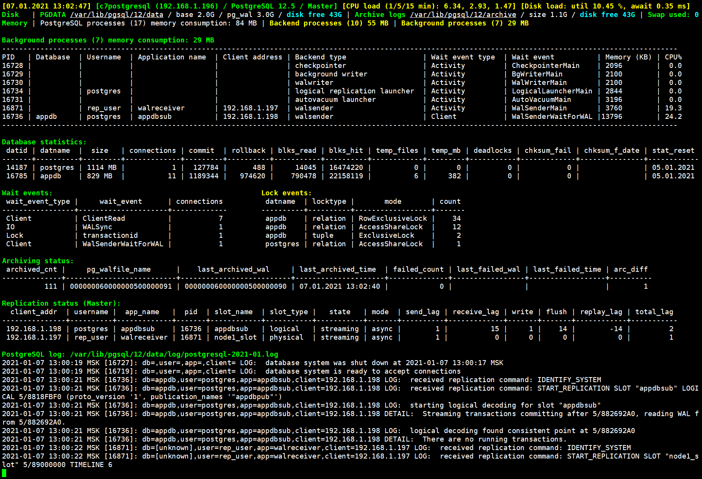
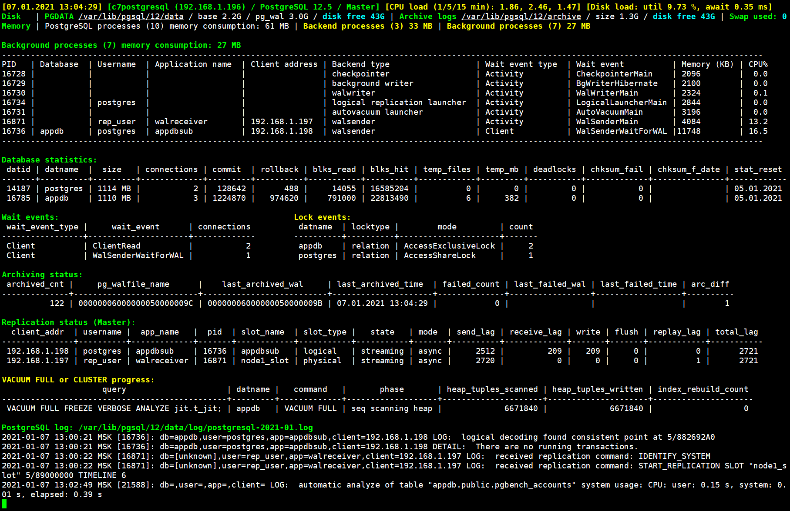
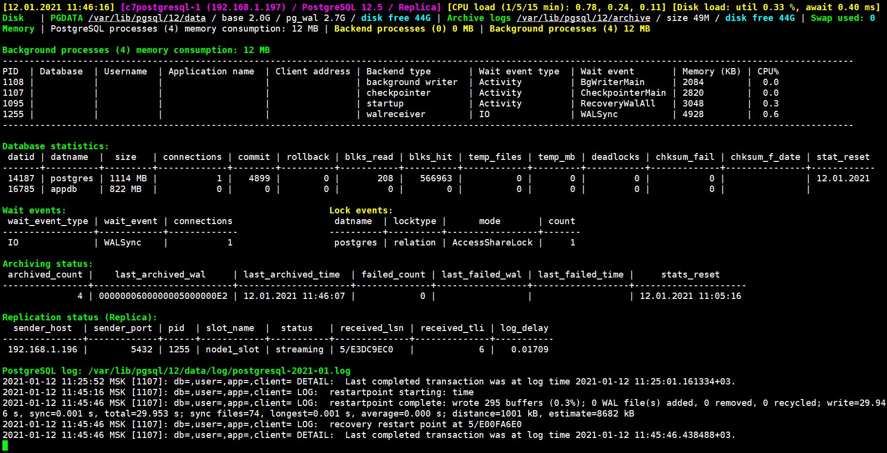
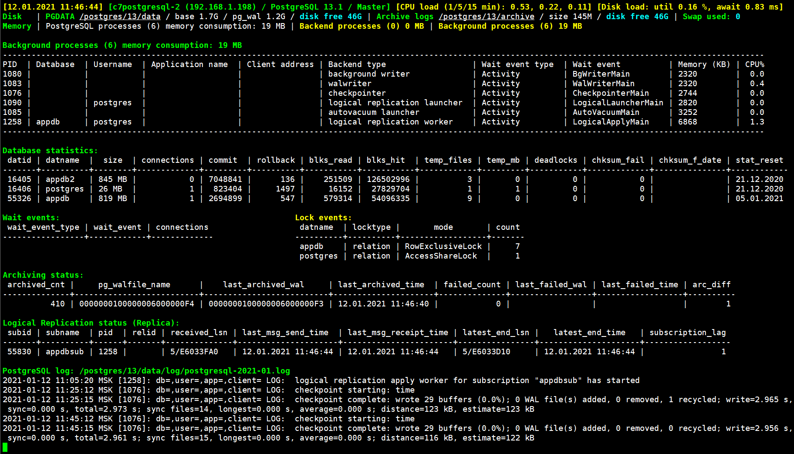
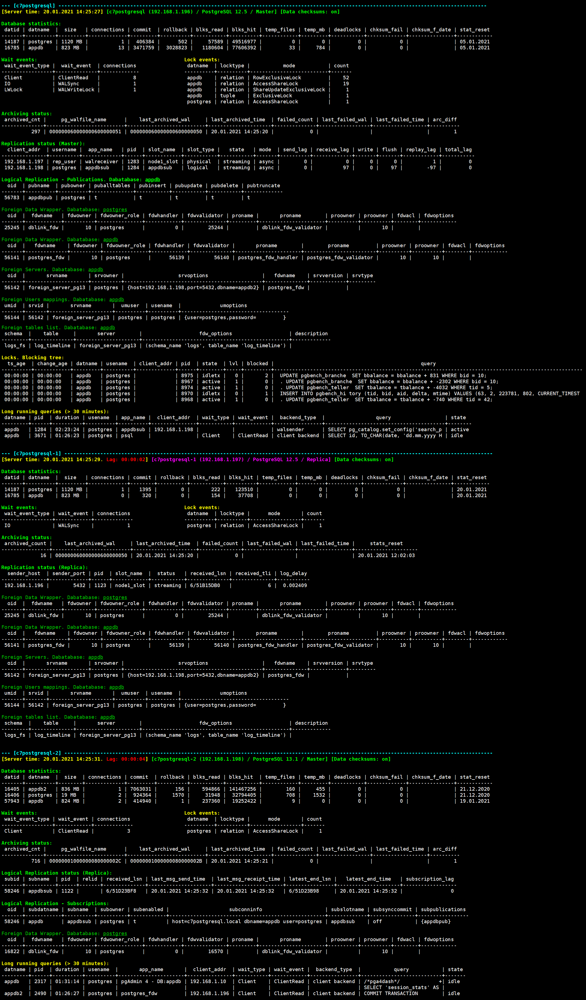

## pg_dba_scripts - PostgreSQL DBA scripts

A collection of shell scripts for PostgreSQL database administrator (DBA). Tested on PostgreSQL versions 9.6, 10, 11, 12, 13 under CentOS 7, Debian 10 and Ubuntu Server 20.04.

#### [scripts/pg_database_activity.sh](#pg_database_activity). PostgreSQL monitoring script, all information is displayed on one page. 
- Displays PostgreSQL version and status (Master / Replica), hostname and IP address, CPU and Disks load.
- Shows the sizes of the main PostgreSQL directories, archived logs and free disk space, swap usage.
- Displays memory consumption by PostgreSQL processes, statistics on databases, waits and locks, archive and replication statuses.
- When activities occur in PostgreSQL, the progress of operations is displayed: vacuum, vacuum full or cluster, index creation, analyze, pg_basebackup.
- At the end, the last entries of the PostgreSQL log file are displayed.
- For ease of perception, information is displayed in color.

[scripts/pg_database_activity_refresh.sh](#pg_database_activity). Fast refresh of the **pg_database_activity.sh** script every 5 seconds.


#### [scripts/pg_database_information.sh](#pg_database_information). PostgreSQL information script, single tape with the current status of a group of PostgreSQL servers.
The script allows you to quickly find out what the servers are doing and see the exact data for logical replication and external tables. 
- Displays server time and lag time, hostname and IP address, PostgreSQL version and status (Master / Replica), data checksums.
- Statistics are also displayed on databases, waits and locks, archive and replication statuses.
- For logical replication, information about publications and subscriptions in the target databases is displayed.
- Displays information about external servers, associated with them by users and tables.
- Blocked sessions and a tree with their locks are displayed, as well as a list of long-running requests.
- When activities occur in PostgreSQL, the progress of operations is displayed: vacuum, vacuum full or cluster, index creation, analyze, pg_basebackup.


#### Small scripts to manage PostgreSQL:
- [scripts/pg_database_hugepages.sh](#pg_database_hugepages). Shows free and used memory in the system, Transparent Huge Pages (THP) status, current usage of HugePages and recommended settings for PostgreSQL.
- [scripts/pg_database_start.sh](#pg_database_start). Start PostgreSQL, confirmation is required.
- [scripts/pg_database_stop.sh](#pg_database_stop). Stop PostgreSQL, confirmation is required.
- [scripts/pg_database_status.sh](#pg_database_status). PostgreSQL status. Additionally, PostgreSQL processes and replication services are displayed.
- [scripts/pg_database_reload_conf.sh](#pg_database_reload_conf). Reloads PostgreSQL configuration files (postgresql.conf, postgresql.auto.conf, pg_hba.conf, pg_ident.conf), displays records related to changes from the log file. If the changed parameter requires a restart, its characteristics are displayed. Operation confirmation is required.
- [scripts/pg_database_logs.sh](#pg_database_logs). Shows the PostgreSQL log file with auto-update. The log file is selected automatically.
- [scripts/settings.txt](#Setup). General settings for all scripts. Required before starting work.


## Installation

As user **postgres**, download the latest version of the scripts collection (see [Releases](https://github.com/Azmodey/pg_dba_scripts/releases) page):
```
# sudo su - postgres
$ wget https://github.com/Azmodey/pg_dba_scripts/archive/1.10.0.tar.gz
```

Extract script files to separate directory (for example **~scripts/**) and grant the necessary execution rights:
```
$ tar xvzf 1.10.0.tar.gz
$ mv pg_dba_scripts-1.10.0/scripts ~/scripts
$ chmod 700 ~/scripts/*.sh
$ chmod 600 ~/scripts/settings.txt
```


## Setup

Modify file **settings.txt**. Uncomment and correct the entries for your current PostgreSQL version.
```
# PostgreSQL version
PG_VER=12						# Supported PostgreSQL versions: 9.6, 10, 11, 12, 13


# Red Hat / CentOS
#PG_BIN=/usr/pgsql-$PG_VER/bin				# Executables directory (by default, do not change!)

#PG_DATA=/var/lib/pgsql/$PG_VER/data			# Main data directory
#PG_ARC=/var/lib/pgsql/$PG_VER/archive			# Archive logs directory
#PG_LOG_DIR=/var/lib/pgsql/$PG_VER/data/log		# Directory for log files. For PostgreSQL 9.6 directory is /pg_log


# Debian / Ubuntu
#PG_BIN=/usr/lib/postgresql/$PG_VER/bin			# Executables directory (by default, do not change!)

#PG_DATA=/var/lib/postgresql/$PG_VER/data		# Main data directory
#PG_ARC=/var/lib/postgresql/$PG_VER/archive		# Archive logs directory
#PG_LOG_DIR=/var/lib/postgresql/$PG_VER/data/log	# Directory for log files. For PostgreSQL 9.6 directory is /pg_log
```

---
### pg_database_activity

PostgreSQL monitoring script, all information is displayed on one page. Displays PostgreSQL version and status (Master / Replica), hostname and IP address, CPU and Disks load. Shows the sizes of the main PostgreSQL directories, archived logs and free disk space, swap usage. It also displays memory consumption by PostgreSQL processes, statistics on databases, waits and locks, archive and replication statuses. When activities occur in PostgreSQL, the progress of operations is displayed: vacuum, vacuum full or cluster, index creation, analyze, pg_basebackup. At the end, the last entries of the PostgreSQL log file are displayed. For ease of perception, information is displayed in color.

#### Setup:

Change the value of the PG_LOG_LINES parameter in the script, which is responsible for displaying the number of last lines of the PosgtreSQL log file.
```
PG_LOG_LINES=15		# Number of PostgreSQL log lines to display. 0 - disable output
```

#### Examples of work:

Running pgbench, 10 backend connections. WALSync wait and Row Exclusive locks. WalSender background processes consumes 19.3% and 24.2% CPU. Total CPU load 6.34 %.




Vacuum full command executing with Access Exclusive lock. Replication lag appeared (total_lag 2721) on streaming and logical replication, archiving are not lagging behind (arc_diff 1). The size of Archive logs increased to 1.3 GB. WalSender background processes consumes 13.2% and 16.5% CPU, overall Disk load 9.73 %. The number of PostgreSQL log file entries has automatically decreased.




Streaming replication to replica server. The server status is highlighted in a separate color, the type of replication (streaming), the slot used (node1_slot) and the lag in replication are shown.




Logical replication to the master PostgreSQL server 13.1. Subscription name (appdbsub) and replication lag (subscription_lag) are shown. Logical replication worker consumes 1.3% CPU.




---
### pg_database_information

A script that provides a single tape with the current status of a group of PostgreSQL servers, allowing you to quickly find out what the servers are doing and see the exact data for logical replication and external tables. Server time and lag time, hostname and IP address, PostgreSQL version and status (Master / Replica), data checksums are displayed. It also displays statistics on databases, waits and locks, archive and replication statuses. For logical replication, information about publications and subscriptions in the target databases is displayed. Displays information about external servers, associated users and tables. Blocked sessions and a tree with their locks are displayed, as well as a list of long-running requests. When activities occur in PostgreSQL, the progress of operations is displayed: vacuum, vacuum full or cluster, index creation, analyze, pg_basebackup.

#### Setup:

Modify the list of current PostgreSQL hosts in the script, or use the setting only for the local server (localhost). 
```
# Array of PosgtreSQL servers
declare -a servers_list=("localhost")					# Local server
#declare -a servers_list=("pg_server_1" "pg_server_2" "pg_server_3")	# Servers list, hostnames. Format: "pg_server_1" "pg_server_2" ...
```

#### Requirements:

- All PostgreSQL hosts must be network accessible. Check with **ping** command (using three servers as an example):
```
$ ping pg_server_1
$ ping pg_server_2
$ ping pg_server_3
```

- The PostgreSQL server must be allowed passwordless user **postgres** access. To do this, create a **~/.pgpass** file from the **postgres** user with the following content, substituting the current password for "password":
```
*:*:*:postgres:password
```

- Grant the necessary rights to **~/.pgpass** file
```
$ chmod 600 ~/.pgpass
```

- Checking the connection to databases of other PostgreSQL servers:
```
$ psql -h pg_server_1
$ psql -h pg_server_2
$ psql -h pg_server_3 
```

#### Example:

A cluster of three PostgreSQL servers. The first server (c7postgresql) runs PostgreSQL 12.5 and is the master for the second server. Logical replication is carried out from it, the publication of appdbpub in the appdb database with a dedicated slot is created. It also has access to external data of the third server, foreign server to host 192.168.1.198, appdb2 database, logs_fs.log_timeline table under the postgres user. The session blocking tree is visible when trying to update the same data. The second server (c7postgresql-1) is a replica, streaming replication from the first server is performed to it. There is a time lag of 2 seconds compared to the first server. The third server (c7postgresql-2) runs on PostgreSQL 13.1 and receives logical replication of the appdb database from the first server, the appdbsub subscription is configured. Two sessions with long running queries are displayed.




---
### pg_database_hugepages

Shows free and used memory in the system, Transparent Huge Pages (THP) status, current usage of HugePages and recommended settings for PostgreSQL.

```
Free and used memory in the system:
              total        used        free      shared     buffers       cache   available
Mem:           3.8G        1.3G        2.2G         12M         23M        291M        2.5G
Swap:          1.9G          0B        1.9G

-----------------------------------
Transparent Huge Pages (THP):
 On: [always] madvise never
Off: always madvise [never]

Status:
always madvise [never]

Tip: disable it

-----------------------------------
Current Huge pages:

AnonHugePages:         0 kB
HugePages_Total:     536
HugePages_Free:      507
HugePages_Rsvd:      382
HugePages_Surp:        0
Hugepagesize:       2048 kB

-----------------------------------
Number of Required HugePages:

Pid:            976
VmPeak:            1095752 kB
Hugepagesize:   2048 kB
Set Huge Pages: 535
```

---
### pg_database_start

Start PostgreSQL, confirmation is required.

```
Start PostgreSQL (Y/N)? y
waiting for server to start....2021-01-04 13:27:18 MSK [45734]: db=,user=,app=,client= LOG:  starting PostgreSQL 12.5 on x86_64-pc-linux-gnu, compiled by gcc (GCC) 4.8.5 20150623 (Red Hat 4.8.5-39), 64-bit
2021-01-04 13:27:18 MSK [45734]: db=,user=,app=,client= LOG:  listening on IPv4 address "0.0.0.0", port 5432
2021-01-04 13:27:18 MSK [45734]: db=,user=,app=,client= LOG:  could not create IPv6 socket for address "::": Address family not supported by protocol
2021-01-04 13:27:18 MSK [45734]: db=,user=,app=,client= LOG:  listening on Unix socket "/var/run/postgresql/.s.PGSQL.5432"
2021-01-04 13:27:18 MSK [45734]: db=,user=,app=,client= LOG:  listening on Unix socket "/tmp/.s.PGSQL.5432"
2021-01-04 13:27:18 MSK [45734]: db=,user=,app=,client= LOG:  redirecting log output to logging collector process
2021-01-04 13:27:18 MSK [45734]: db=,user=,app=,client= HINT:  Future log output will appear in directory "log".
 done
server started
```

---
### pg_database_stop

Stop PostgreSQL, confirmation is required.

```
Stop PostgreSQL (Y/N)? y
waiting for server to shut down.... done
server stopped
```

---
### pg_database_status

PostgreSQL status. Additionally, PostgreSQL processes and replication services are displayed.

```
PostgreSQL processes:
UID         PID   PPID  C STIME TTY          TIME CMD
postgres   1030      1  0 17:29 ?        00:00:01 /usr/pgsql-12/bin/postmaster -D /var/lib/pgsql/12/data/
postgres   1101   1030  0 17:29 ?        00:00:00  \_ postgres: logger   
postgres   1105   1030  0 17:29 ?        00:00:00  \_ postgres: checkpointer   
postgres   1106   1030  0 17:29 ?        00:00:00  \_ postgres: background writer   
postgres   1107   1030  0 17:29 ?        00:00:00  \_ postgres: walwriter   
postgres   1108   1030  0 17:29 ?        00:00:00  \_ postgres: autovacuum launcher   
postgres   1109   1030  0 17:29 ?        00:00:00  \_ postgres: archiver   
postgres   1110   1030  0 17:29 ?        00:00:00  \_ postgres: stats collector   
postgres   1111   1030  0 17:29 ?        00:00:00  \_ postgres: logical replication launcher   
postgres   1375   1030  0 17:30 ?        00:00:00  \_ postgres: walsender rep_user 192.168.1.197(49190) streaming 6/67241080
postgres  10636   1030  0 18:05 ?        00:00:00  \_ postgres: walsender postgres 192.168.1.198(53956) idle

PostgreSQL network connection:
(Not all processes could be identified, non-owned process info
 will not be shown, you would have to be root to see it all.)
Proto Recv-Q Send-Q Local Address           Foreign Address         State       PID/Program name    
tcp        0      0 0.0.0.0:5432            0.0.0.0:*               LISTEN      1030/postmaster     

PostgreSQL status:
pg_ctl: server is running (PID: 1030)
/usr/pgsql-12/bin/postgres "-D" "/var/lib/pgsql/12/data/"

PostgreSQL replication service (sender). Works on Master server:
UID         PID   PPID  C STIME TTY          TIME CMD
postgres   1375   1030  0 17:30 ?        00:00:00 postgres: walsender rep_user 192.168.1.197(49190) streaming 6/67241080
postgres  10636   1030  0 18:05 ?        00:00:00 postgres: walsender postgres 192.168.1.198(53956) idle

PostgreSQL replication service (receiver). Works on Replica server:
UID         PID   PPID  C STIME TTY          TIME CMD

PostgreSQL logical replication service (worker). Works on Replica server:
UID         PID   PPID  C STIME TTY          TIME CMD
```

---
### pg_database_reload_conf

Reloads PostgreSQL configuration files (postgresql.conf, postgresql.auto.conf, pg_hba.conf, pg_ident.conf), displays records related to changes from the log file. If the changed parameter requires a restart, its characteristics are displayed. Operation confirmation is required.

```
Reload PostgreSQL configuration (Y/N)? y
server signaled

PostgreSQL log: /var/lib/pgsql/12/data/log/postgresql-2021-01.log
2021-01-04 13:29:00 MSK [45734]: db=,user=,app=,client= LOG:  received SIGHUP, reloading configuration files
2021-01-04 13:29:00 MSK [45734]: db=,user=,app=,client= LOG:  parameter "wal_level" cannot be changed without restarting the server
2021-01-04 13:29:00 MSK [45734]: db=,user=,app=,client= LOG:  configuration file "/var/lib/pgsql/12/data/postgresql.conf" contains errors; unaffected changes were applied

Pending restart parameters:
-[ RECORD 1 ]---+-------------------------------------------------
name            | wal_level
setting         | replica
unit            | 
category        | Write-Ahead Log / Settings
short_desc      | Set the level of information written to the WAL.
extra_desc      | 
context         | postmaster
vartype         | enum
source          | configuration file
min_val         | 
max_val         | 
enumvals        | {minimal,replica,logical}
boot_val        | replica
reset_val       | replica
sourcefile      | /var/lib/pgsql/12/data/postgresql.conf
sourceline      | 194
pending_restart | t
```

---
### pg_database_logs

Shows the PosgreSQL log file with auto-update. The log file is selected automatically.

```
PostgreSQL log: /var/lib/pgsql/12/data/log/postgresql-2021-01.log
2021-01-04 13:31:27 MSK [47339]: db=,user=,app=,client= LOG:  database system was shut down at 2021-01-04 13:31:24 MSK
2021-01-04 13:31:27 MSK [47331]: db=,user=,app=,client= LOG:  database system is ready to accept connections
2021-01-04 13:31:29 MSK [47348]: db=[unknown],user=rep_user,app=walreceiver,client=192.168.1.196 LOG:  received replication command: IDENTIFY_SYSTEM
2021-01-04 13:31:29 MSK [47348]: db=[unknown],user=rep_user,app=walreceiver,client=192.168.1.196 LOG:  received replication command: START_REPLICATION SLOT "node_a_slot" 5/1F000000 TIMELINE 5
```
